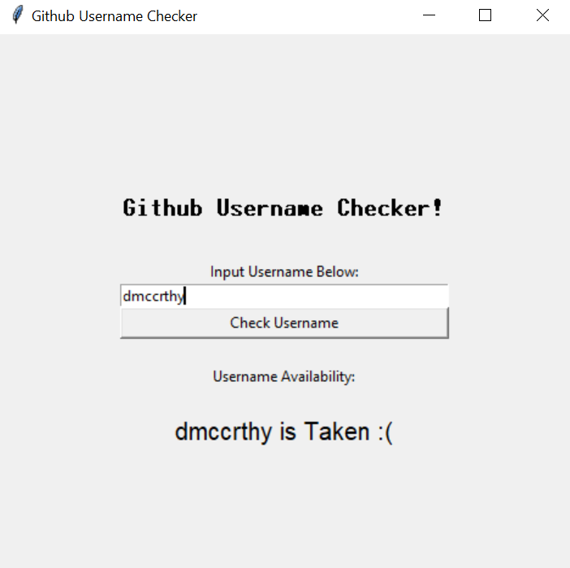

# Github Username Checker ✅
A simple python-based application for checking the avalaibility of github usernames.



<br />

# Usage:
- Open using command line as shown below.
````
[user@hostname github-username-check]$ python run.py
````
- **Note:** Depending on OS you may need to run as python3 instead of python